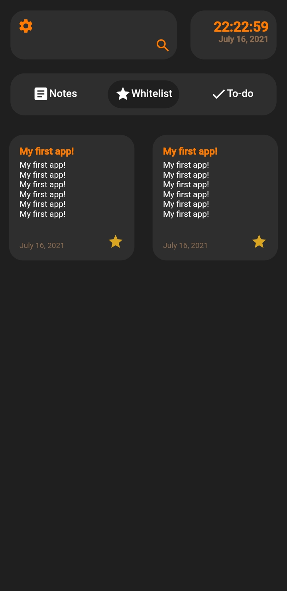

[![Sevnotes rg][]][SevNotes rg link]
<p align="center">
  
       
  

</p>

<h1 align="center">SevNotes 📄</h1>


<h2 align="center">What is SevNotes?</h2>

__SeveNotes__ is my first aplicattion i maded on my own and it's a note and a to-do aplication. I used MobX for the State-Manegement. For data, I saved it in a JSON file and i use SheredPrefreneces.

**I learned a lot with this project!**

---

<h2 align="center">Features 📐</h2>

- 6 different themes
- Animations
- Whitelist
- Searching
- A Digital clock and a date
- Splash screen
---

<h2 align="center">Layout 🎨</h2>

<p align="center">
  
  
  
  
  
  
  
</p>

---

<h2 align="center">How to use 👨‍💻</h2>

```
- Clone this repo:
$ git clone https://github.com/GabrielBassoi/SevNotes-2.git

- Go to the path:
$ cd SevNotes

- Intall the dependencies:
SevNotes$ flutter pub get

- Start the app:
SevNotes$ flutter run
```

---
<h2 align="center">PlayStore   
  
PlayStore link: [SevNotes](https://play.google.com/store/apps/details?id=bassoi.com.sevnotes2)

---

<h2 align="center">Thanks!!! 🎆🎇✨</h2>

[SevNotes rg]: img/Rg-sevnotes.png
[SevNotes rg link]: https://github.com/GabrielBassoi/SevNotes-2/blob/master/img/Rg-sevnotes.png?raw=true

